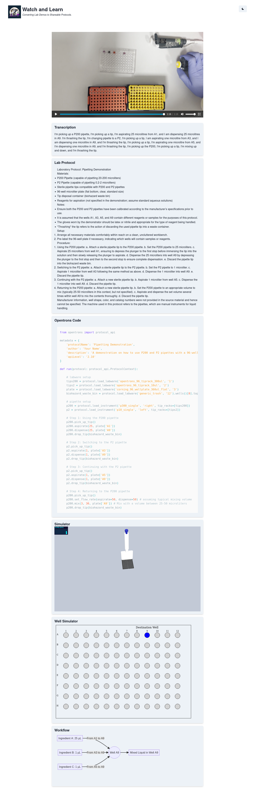

# Watch and Learn

For [EF](https://www.joinef.com/)'s [Bio x AI Hackathon](https://lu.ma/ksh6r32e), we built a multimodal AI system called "Watch and Learn" and our team won first prize.

Lab protocols are essential to bio research, but they're hard to describe, hard to learn, hard to reproduce, and really hard to automate.
So we used cutting edge multimodal AI to build something that would have been impossible just a few weeks before.

> This enables every scientist to capture, compare, learn, and then automate lab protocols.

Read more about it at [gianluca.ai/hackathon-watch-and-learn](https://gianluca.ai/hackathon-watch-and-learn/)

---

    <a href="https://www.loom.com/share/dd54d70361304ed0b7bf21c3555f13e6">
      
Watch & Learn - EF Bio x AI hackathon - Team #3 - Watch Video

    </a>
    
  

Linked above is the 3 minute demo video I submitted on behalf of our team. You can also view it [directly on loom's website](https://www.loom.com/share/dd54d70361304ed0b7bf21c3555f13e6?sid=22aeb864-f16c-4167-8181-62dc63d1caee).

---

## Screenshot of demo

## How it works

- Users upload a smartphone video of themselves performing and describing a lab protocol. Just like if they were teaching it to another person.
- We extract the audio, which gets rapidly transcribed with OpenAI's Whisper model.
- The transcribed text is returned to the UI, but also sent along as input to the next step.
- The video is chunked into a series of still frames, which are passed (in sequence) to GPT-Vision, along with the full transcript.
- GPT-Vision uses that multimodal image and text input to generate a full write-up of the protocol, which is returned to the UI. This can be directly copy-pasted into a lab notebook or methods section of a paper.
- Another GPT-4 workflow uses the detailed protocol to generate OpenTrons instructions (via the Python API) that implement the protocol on an [OpenTrons laboratory robot](https://opentrons.com/).
- With the full natural language protocol and the OpenTrons code, we are able to parse the protocol into the following outputs using LLM-driven workflows:
    - A diagramatic representation of the workflow, rendered using Mermaid.
    - Positional data for a 2D simulation of how the robot would process the protocol on a 96-well plate.
    - Positional data for a 3D simulation of how the robot would implement the protocol in 3D space.
- All the diagrams and 2D and 3D simulations are embedded into the UI.

One huge advantage of using GPT-Vision with both the video frames _and_ the transcribed audio is that it has unified context and thus has a much better understanding of the small nuances of the protocol. Our testing showed that this multimodal context massively reduced errors in understanding the protocol and added fault tolerance to transcription and image understanding errors.

For around $0.30 in API costs, the system is able to generate a detailed and descriptive lab protocol (that you can put in your methodology section, save to your own records, and share with other researchers very easily), as well as a reliable starting point for automating the protocol at scale on OpenTrons hardware found in many labs today.

We were quite disappointed by the existing low-code tools for building and testing lab robot automation code, so we decided to build our own 2D and 3D simulations that would run the code _in silico_ and allow for rapid (and much less costly) iteration on tweaking a protocol.

Overall, we built something that can take you from a really quick walkthrough of the lab video (from anywhere in the world), and not only save that video for your record, but have all of the possible things you could want from that via text: the automation code or diagrams to be able to share, review later or use to train other people. 

## Tech stack

- GPT-4V (vision): video understanding and protocol generation
- Whisper: audio transcription
- GPT-4: opentrons code generation
- nextjs and ChakraUI: web app and frontend
- three.js: 3D robotics visualisations
- mermaid.js: workflow diagrams
- pyplot: 2D robotics visualisations
- Google Cloud: video storage and cloud functions
- vercel: hosting the webapp and 3D simulation

## Hackathon team

An incredibly talented team of biologists and ML experts came together to apply cutting-edge tech to a major problem and build something we love.

- [Gianluca Truda](https://www.linkedin.com/in/gianluca-truda/)
- [Tom Tumiel](https://twitter.com/tomtumiel)
- [Jacopo Gabrielli](https://www.linkedin.com/in/jacopo-gabrielli-453b58139/)
- [Daniele Simoneschi](https://www.linkedin.com/in/danielesimoneschi)
- [Lisa Neidhardt](https://www.linkedin.com/in/lisa-neidhardt)
- [Cathal O'Reilly](https://www.linkedin.com/in/cathalbio/)

